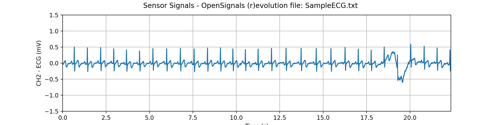

# opensignalsreader
Python package to read [OpenSignals (r)evolution](http://bitalino.com/en/software) files and automatic sensor data conversion for [BITalino (r)evolution](http://bitalino.com) sensor data.

## Installation
This package can be installed using the ```pip``` tool:
```python
pip install opensignalsreader
```

### Examples & How to Use this Package
This package comes with the OpenSignalsReader class which facilitates the import of sensor signals acquired using the _OpenSignals (r)evolution_ software. Additionally, it does also read and save the most important acquisition metadata.

The examples below demonstrate how to use this class to load OpenSignals files, access signals, access metadata, and how to plot the imported sensor data.

#### Reading OpenSignals Files
Import OpenSignalsReader class and read OpenSignals file ('SampleECG.txt').
```python
# Import OpenSignalsReader
from opensignalsreader import OpenSignalsReader

# Read OpenSignals file
acq = OpenSignalsReader('SampleECG.txt')
```

Note, when using the `OpenSignalsReader` class in scripts (or other formats), use absolute file paths to ensure that the file will be found and used.

#### Accessing Sensor Data
Objects of the `OpenSignalsReader` class store raw digital sensor values and additionally their conversion into the sensor's original physical units (e.g. ECG -> mV). Use the `OpenSignalsReader.raw()` and the `OpenSignalsReader.signal()` methods to access the signals.

Accessing individual sensor data (this method returns data in a NumPy array):
```python
# Access single sensor signal using the sensor's channel number
acq.raw(2)
acq.signal(2)

# Access single sensor signal using the sensor's label
acq.raw('ECG')
acq.signal('ECG')
```

Accessing multiple sensor data (this method returns data in a dictionary with the sensor labels as keys):
```python
# Access multiple sensor signals using the channel numbers (here: channel 1 & 2)
acq.raw([1,2])
acq.signal([1,2])

# Access multiple sensor signals using the sensor labels (here: channel 1 & 2)
acq.raw(['ECG', 'EEG'])
acq.signal(['ECG', 'EEG'])
```

#### Plotting Sensor Data
The OpenSignalsReader class comes with plotting features as shown below.

Read OpenSignals file and plot all signals.
```python
# Read OpenSignals file and plot all signals
acq = OpenSignalsReader('SampleECG.txt', show=True)

# Read OpenSignals file and plot all raw signals.
acq = OpenSignalsReader('SampleECG.txt', show=True, raw=True)
```
Plotting a single channel ECG signal results in the plot below.



Alternatively, select the individual signals you want to plot using the `OpenSignalsReader.plot()` and the signal sensor label or channel number.

```python
# Plot ECG signal using the channel number
acq.plot('ECG')

# Plot ECG signal using the sensor label
acq.plot(2)

# Plotting multiple signals using the channel number
acq.plot(['ECG', 'EMG'])

# Plotting multiple signals using the sensor label
acq.plot([1, 2])
```

To plot the raw signals set the `raw` parameter to `True`.

```python
# Plot raw ECG data
acq.plot('ECG', raw=True)
```

### BITalino (r)evolution Transfer Functions
This package includes the _bitalino_tf_ module which contains all available transfer functions of the current BITalino (r)evolution sensors. It is used by the _OpenSignalsReader_ class to convert raw signal samples imported from OpenSignals files into their original units.

This package can also be useful if you want to convert sensor signals within your own software when not importing signals from the OpenSignals files.

BITalino sample series can be converted into their original units using the sensor's transfer function. See below how to use the functions of this module on the example of the ECG sensor.
```python
import numpy as np
import opensignalsreader.bitalino_tf as bit
signal = np.loadtxt('SampleECG.txt', 'r')[:, -1]

# Convert signal to mV (10-bit resolution as default resolution)
ecg_signal = bit.ecg(signal)

# Convert signal acquired with 6-bit sampling resolution
ecg_signal = bit.ecg(signal, 6)
```

List of currently supported sensors (& datasheets):
- [Electrocardiography (ECG)](http://bitalino.com/datasheets/REVOLUTION_ECG_Sensor_Datasheet.pdf)
- [Electroencephalography (EEG)](http://bitalino.com/datasheets/REVOLUTION_EEG_Sensor_Datasheet.pdf)
- [Electromyography (EMG)](http://bitalino.com/datasheets/REVOLUTION_EMG_Sensor_Datasheet.pdf)
- [Electrodermal Activity (EDA)](http://bitalino.com/datasheets/REVOLUTION_EDA_Sensor_Datasheet.pdf)
- [Accelerometer (ACC)](http://bitalino.com/datasheets/REVOLUTION_ACC_Sensor_Datasheet.pdf)
- [Temperature (TEMP)](http://bitalino.com/datasheets/REVOLUTION_TMP_Sensor_Datasheet.pdf)
- [High Definition Temperature (NTC)](http://bitalino.com/datasheets/NTC_Sensor_Datasheet.pdf)
- [Light (LUX)](http://bitalino.com/datasheets/REVOLUTION_LUX_Sensor_Datasheet.pdf)
- SpO2 Reader (OSL)
- Glucose Meter Reader (GMR)
- Blood Pressure Reader (BPR)
- [Electrogastropraphy (EGG)](http://bitalino.com/datasheets/REVOLUTION_EGG_Sensor_Datasheet.pdf)
- [Electrooculography (EOG)](http://bitalino.com/datasheets/REVOLUTION_EOG_Sensor_Datasheet.pdf)

### Useful Links
Detailed documentation about BITalino (r)evolution sensors can be found here:

http://bitalino.com/en/learn/documentation

BITalino (r)evolution sample files can be found here:

https://github.com/BITalinoWorld/revolution-sample-data

Download the OpenSignals (r)evolution software from the BITalino website:

http://bitalino.com/en/software

### Important Notes
- OpenSignals (r)evolution files in .H5 or .EDF format are not supported (yet)
- No multi-device acquisition functions supported (yet, currently limited to a single device only) 
- Number of plotted signals is currently limited to 6 signals only

### Dependencies
- [matplotlib](https://matplotlib.org)
- [numpy](http://www.numpy.org)

### Context of this Work
This package is part of the master thesis "Development of an Open-Source Python Toolbox for Heart Rate Variability (HRV)" at the University of Applied Sciences Hamburg, Germany and PLUX wireless biosignals, S.A.
